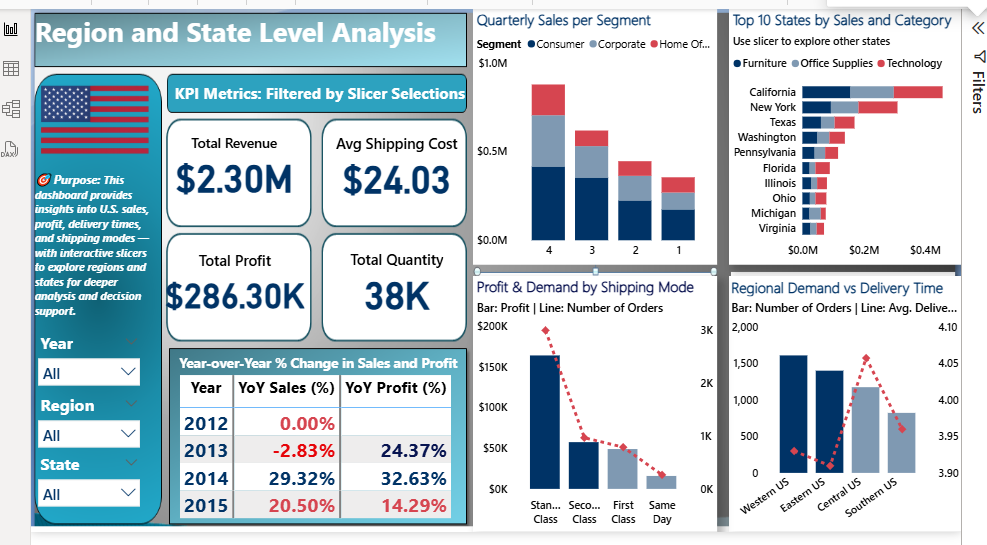
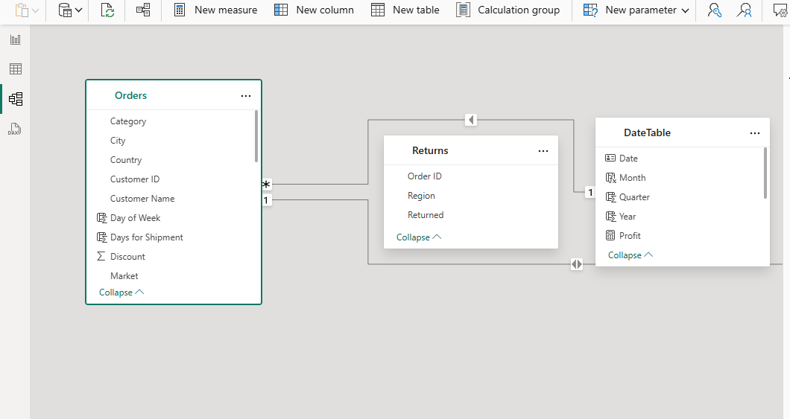

# 📑 Superstore USA – Detailed Sales, Profitability & Demand Analysis  

This document provides a **comprehensive analysis** of the *USA segment* of the Global Superstore dataset. The project was executed in **Power BI**, focusing on understanding sales trends, regional performance, profitability across categories, customer demand patterns, and the role of discounts and shipping.  

The analysis is organized into three dashboards:  
1. **Sales Performance**  
2. **Region & State-Level Analysis**  
3. **Category & Subcategory Profitability**  

---

## 🔹 1. Sales Performance Analysis  

**Purpose:** To assess overall sales trends, revenue growth, and segment contributions.  

### Key Insights  
- 📈 **Quarterly Sales Growth:** Sales progressively increase across quarters, with **Q4 generating the highest revenue** every year.  
- 👥 **Segment Performance:**  
  - **Consumer** segment contributes the most to sales.  
  - **Corporate** follows closely.  
  - **Home Office** contributes least but shows steady growth.  
- 💻 **Category Sales:**  
  - **Technology** leads with ~$836K sales.  
  - **Furniture** follows with ~$740K.  
  - **Office Supplies** slightly lower at ~$720K.  
  - Performance across categories is relatively balanced, showing **strong product diversification**.  
- 🌍 **Geographic Spread:** Sales are spread thinly across most U.S. states, with a few states (California, New York, Texas) contributing disproportionately high sales.  

### Implications  
- Strong Q4 seasonality suggests opportunities for **targeted promotions before the holiday season**.  
- Over-reliance on top states (CA, NY, TX) exposes business risk if demand slows in these hubs.  
- Segment balance shows a healthy customer mix, but **Home Office segment could be a growth target**.  

---

## 🔹 2. Regional & State-Level Analysis  

**Purpose:** To uncover performance differences across U.S. regions and states, while analyzing shipping efficiency and YoY trends.  

### Key Insights  
- 📉 **Year-over-Year Decline:** Sales and profit **both dropped ~9% and ~18% YoY**, signaling challenges despite overall quarterly growth.  
- 🏙️ **Regional Trends:**  
  - **Western U.S.** is the customer hub, generating the highest order volume.  
  - **Eastern U.S.** follows closely.  
  - Central and Southern regions lag behind.  
- 🗺️ **State-Level Leaders:** California, New York, and Texas dominate in sales, with all three showing strong performance across product categories.  
- 🚚 **Shipping Mode & Delivery:**  
  - **Standard Class** is the most used mode, delivering the highest sales and profit by far.  
  - Higher order volumes correlate with **shorter delivery days** — showing that demand density improves logistics efficiency.  
  - Other modes (Second Class, First Class, Same Day) have smaller adoption and lower profitability.  

### Implications  
- The YoY decline requires investigation — possibly tied to **excessive discounting, rising costs, or declining demand** in some regions.  
- West and East regions remain reliable revenue hubs, but **Central & South require targeted strategies** to balance performance.  
- Shipping data suggests **expanding Standard Class capacity** could optimize profitability and customer satisfaction.  

---

## 🔹 3. Category & Subcategory Profitability Analysis  

**Purpose:** To understand profitability drivers, discount dynamics, and product demand patterns.  

### Key Insights  
- 💰 **Profitability vs Sales Mismatch:**  
  - **Furniture:** Despite being the **second-highest sales category (~$740K)**, profit margins are extremely low (~2.47%).  
  - **Office Supplies:** Slightly lower sales (~$720K) but **high profit margin (~17%)**, equal to Technology.  
  - **Technology:** High sales (~$836K) with **strong 17% profit margin**.  
- 🔄 **Return Rate:** Overall **4% return rate** — relatively low, indicating product quality is not a major issue.  
- 🛒 **Subcategory Demand:**  
  - Office Supplies & Furniture subcategories dominate demand volume.  
  - Technology products, while fewer in number, generate higher revenue per unit.  
- 💸 **Discount Impact:**  
  - Strong **negative correlation between discounts and profit margins** — higher discounts reduce profitability.  
  - Exception: **Q3 anomaly**, where discounting showed limited effect, suggesting market-specific dynamics.  

### Implications  
- Furniture category requires **urgent strategic review** (e.g., renegotiating supplier contracts, price adjustments, or reducing discount dependency).  
- Office Supplies is a **hidden profitability driver** — opportunities exist to scale this category further.  
- Discounting strategies must be revisited — especially in Q1 where profit spike naturally without requiring heavy discounts.  

---

## 🔹 4. Business Recommendations  

Based on the above insights, the following actions are recommended:  

1. **Address YoY Sales & Profit Decline:**  
   - Reassess pricing and discount policies.  
   - Investigate cost escalation in logistics or supplier chains.  
   - Implement customer retention programs in top-performing states.  

2. **Category Strategy:**  
   - **Furniture:** Improve margins via supplier renegotiations or price restructuring. Consider reducing reliance on discounts.  
   - **Office Supplies:** Scale aggressively, as it provides stable profits despite lower sales volume.  
   - **Technology:** Maintain momentum with bundled offers to cross-sell Office Supplies.  

3. **Regional Strategy:**  
   - Double down on **Western & Eastern hubs** with localized promotions.  
   - Develop targeted campaigns for **Central & Southern regions** to balance demand spread.  

4. **Shipping Optimization:**  
   - Expand **Standard Class shipping** capacity, as it balances both profitability and demand.  
   - Review low-demand shipping modes — consider pricing adjustments to increase uptake.  

5. **Discount Management:**  
   - Align discounting strategy with **seasonal demand** (heavier in low quarters, lighter in Q4).  
   - Use targeted discounts for slow-moving Furniture items instead of blanket promotions.  

---

## 🔹 5. Conclusion  

The U.S. Superstore market shows **strong growth potential**, with demand diversified across categories and segments. However, key risks include the **YoY sales & profit decline** and the **low profitability of Furniture** despite high sales.  

By realigning category strategy, optimizing shipping modes, and refining discount policies, the business can strengthen both profitability and customer satisfaction while sustaining long-term growth.  

---

## 📊 Dashboards Overview  

### 1️⃣ Sales Performance Dashboard  
- KPIs: Revenue, Profit, Quantity.  
- Sales by Segment, Category, and State.  
- Quarterly trend analysis with slicers.  

📷 *Preview:*  
  

---

### 2️⃣ Region & State Analysis Dashboard  
- KPIs: Revenue, Profit, Shipping Cost, Quantity.  
- YoY comparison of Sales & Profit.  
- Sales and Profitability by Shipping Mode.  
- Top 10 States by Sales & Regional Delivery trends.  

📷 *Preview:*  
  

---

### 3️⃣ Category & Subcategory Profitability Dashboard  
- KPIs: Revenue, Profit Margin %, Return Rate.  
- Category vs Profitability breakdown.  
- Subcategory demand visualization.  
- Discounts vs Profitability analysis.  

📷 *Preview:*  
  

---

## 🔹 Data Model  

📷 *Preview:*  
  

---

