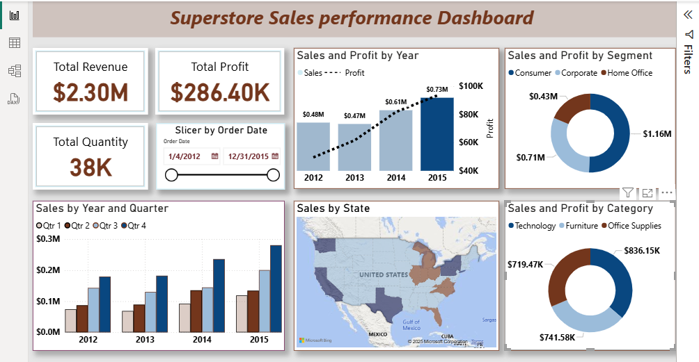

# 📊 Superstore USA: Sales, Profitability & Demand Optimization (Power BI Project)  
### A Power BI project exploring overall sales performance, trends, regional performance, customer demand, and profitability drivers  

This project analyzes **USA sales data** from the Global Superstore dataset to uncover insights into sales performance, profitability, and regional trends. Using **Power BI**, I built interactive dashboards that provide actionable business insights for decision-making.  

---

## 🚀 Project Objectives  

- Analyze **sales performance** across years, categories,states and customer segments.  
- Evaluate **profitability and return rates** by product category & subcategory.  
- Perform **regional and state-level analysis** of sales, shipping, and delivery.  
- Explore the **impact of discounts** on profit margins.  
- Build **interactive dashboards** that support business strategy and decision-making.  

---
The goal is to uncover insights that support **data-driven decision making** for sales growth and operational efficiency. 

## 🗂 Data Preparation  
- **Data Source**: Global Superstore dataset (filtered for USA).  
- **Data Cleaning**:  
  - Standardized date fields and created a custom **Date table** for time intelligence (Year, Quarter, Month).  
  - Removed duplicates and handled missing values.  
  - Verified numeric fields (Sales, Profit, Discount) for consistency.  

- **Calculated Columns & Measures**:
  - Total Sales 
  - Year-over-Year Sales Growth %  
  - Year-over-Year Profit Growth %  
  - Profit Margin %  
  - Return Rate %  
  - Average Delivery Days  

---

## 🗂 Data Model  
The data model was structured into a **star schema** to optimize reporting:  

- **Fact Table**: Orders (Sales, Profit, Discounts, Quantity, Shipping details, Customer info)  
- **Dimension Tables**:  
  - **Date** → Enables accurate time intelligence  
  - **Returns** → Tracks returned products linked to Orders

📷 *Data Model Screenshot:*  
 

## 🖼️ Dashboards Overview  

### 1. **Overall Sales Performance**  
- Quarterly sales increased progressively, with **Q4 as the strongest period**.  
- **Consumer segment** leads in sales, followed by Corporate.  
- **Technology** generated the highest revenue (~$836K), but **Furniture** underperformed in margins (~5%).  

  

---

### 2. **Regional & State Analysis**  
- **YoY sales & profits dropped ~9%** and ~18%**, despite strong demand.
- **California, New York, and Texas** lead in sales, but **sales are spread thinly across most states**.  
- **Western U.S.** drives the most orders, followed by the East.  
- **Delivery times shorten with higher order volumes**, suggesting operational efficiency at scale.  
- **Standard Class shipping** dominates demand & profitability.  

  

---

### 3. **Category & Sub-Category Insights**  
- **Office Supplies & Technology** yield strong profit margins (~17%).  
- **Furniture sells well but drags profits** due to high costs.  
- Sub-categories like **Binders, Paper, and Chairs** dominate demand.  
- Discount patterns show: **higher discounts = lower profit margin** (with Q3 as an exception)

  

## 📈 Key Insights 
-Return rate was **only 4%**, showing strong product acceptance.  
- Profit margin averaged **12.47%** across all categories.
- High sales ≠ high profit → *Furniture drives revenue but weak margins*.  
- Demand & profitability align in **Standard Class shipping**.  
- Sales are concentrated in a few states while spread thinly across the rest.  
- Regional strengths show **California, New York, Texas, and Western U.S.** as growth hubs.  
- Discounting strategy strongly impacts profitability.  

---

## ✅ Recommendations  

- **Investigate YoY decline** in both sales and profit despite strong quarterly trends. Possible causes: pricing pressure, competitor activity, or over-discounting.  
- **Revisit discounting strategy**, as heavy discounts consistently erode profitability.  
- **Optimize Furniture pricing & supply chain** since it sells well but delivers weak profit margins.  
- **Scale Standard Class shipping**, which aligns best with customer demand and profitability.  
- **Expand in Western and Eastern US**, where customer hubs are concentrated.  
- **Encourage high-margin subcategories** (Office Supplies, Technology) through marketing campaigns and bundles.  

---
---

## 🛠 Tools & Skills Demonstrated  

- **Power BI**: Data modeling, DAX measures, interactive dashboards, slicers & filters.  
- **Power Query**: Data cleaning and transformation.  
- **Business Analysis**: KPI development, profit margin analysis, return rate insights.  
- **Visualization Design**: Effective use of KPIs, map, charts, and storytelling dashboards.  

## 📂 Repository Content  
- **Dashboards/** → Power BI dashboard screenshots  
- **Data Model/** → Project data model image  
- **[Documentation.md](./Documentation.md)** → Full analysis & detailed insights

- ## 🏁 Conclusion  
The dashboards highlight steady quarterly growth but a 9% YoY decline in sales and 18% YoY decline in profit.  
California, New York, and Texas lead performance, while Technology and Office Supplies drive strong margins.  
Furniture lags in profitability, and discounts remain a key factor reducing overall profit margins. 

## 📬 Contact  
👤 *Jumoke Ashogbon*  
🔗 [www.linkedin.com/in/ashogbon-jumoke-b825a7347](#)  • [olajumokecourtney@gmail.com
](#)  
  

